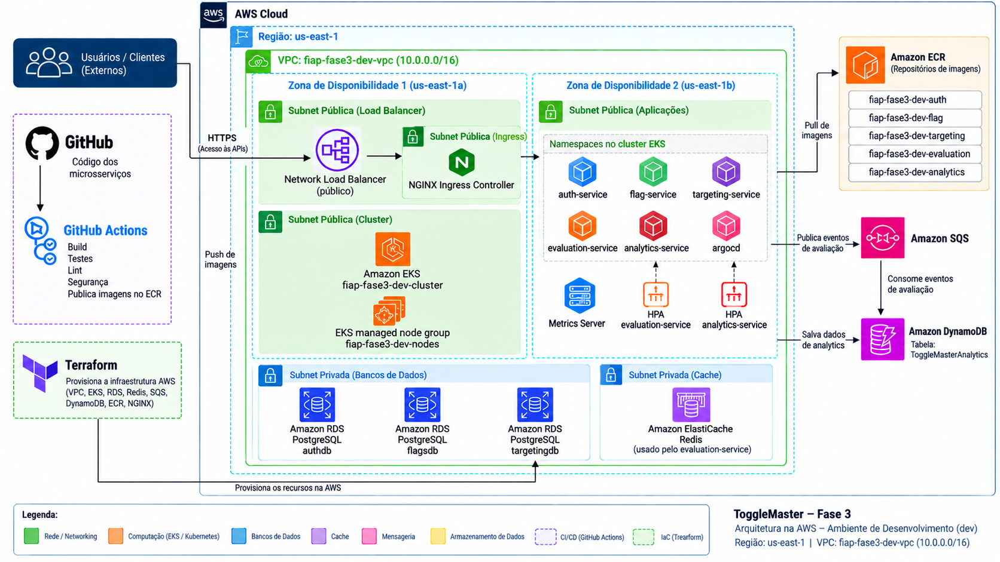

# Fase 3 — Terraform

Infraestrutura como código da plataforma ToggleMaster na AWS, usando Terraform.

## O que este projeto faz

Este repositório provisiona a base necessária para executar os microsserviços no
Amazon EKS e fornecer seus serviços de dados, mensageria e exposição externa:

- VPC 10.0.0.0/16 com duas subnets públicas e duas privadas;
- Amazon EKS e managed node group;
- Metrics Server para os HPAs;
- Amazon ECR para as cinco imagens;
- três instâncias RDS PostgreSQL: authdb, flagsdb e targetingdb;
- ElastiCache Redis para o evaluation-service;
- Amazon SQS para eventos de avaliação;
- DynamoDB ToggleMasterAnalytics para analytics;
- Argo CD instalado via Helm no namespace argocd;
- NGINX Ingress Controller com Network Load Balancer público.

Este projeto cria a infraestrutura. Os manifests dos serviços e das Applications
do Argo CD ficam no repositório fase3-argocd.

## Arquitetura



O EKS possui endpoint público e privado. O NGINX Ingress recebe o tráfego externo
por um Network Load Balancer nas subnets públicas. RDS e Redis ficam nas subnets
privadas. O Argo CD é um serviço ClusterIP e é acessado localmente por
port-forward.

## Estrutura do projeto

```text
.
├── main.tf, providers.tf, variables.tf, outputs.tf, versions.tf
└── modules/
    ├── network/       # VPC, subnets e rotas públicas
    ├── eks/           # cluster, nodes e Metrics Server
    ├── rds/           # PostgreSQL reutilizável por serviço
    ├── redis/         # ElastiCache Redis
    ├── sqs/           # fila de eventos
    ├── dynamodb/      # tabela de analytics
    ├── ecr/           # repositório de imagem por serviço
    ├── argocd/        # instalação do chart Argo CD
    └── ingress_nginx/  # NGINX Ingress e NLB
```

Os arquivos da raiz compõem os módulos e expõem seus outputs. Variáveis
específicas de ambiente devem ser fornecidas por terraform.tfvars ou por
argumentos -var. Não versionar credenciais, estado, planos ou valores secretos.

## Pré-requisitos

- Terraform;
- AWS CLI configurada;
- credenciais com permissão para criar os recursos e acessar o EKS;
- perfil e região AWS conferidos antes de aplicar.

## Uso

Execute na raiz:

```bash
terraform init
terraform fmt -check -recursive
terraform validate
terraform plan -out=tfplan
terraform apply tfplan
```

Sempre revise o plan antes do apply, especialmente alterações de rede, IAM,
substituições de banco, exposição pública e impacto de custo.

Para configurar o kubectl:

```bash
aws eks update-kubeconfig --region us-east-1 --name fiap-fase3-dev-cluster
kubectl get nodes
```

Para acessar o Argo CD localmente:

```bash
kubectl -n argocd port-forward svc/argocd-server 8080:443
```

Abra https://localhost:8080. A senha inicial está no Secret
argocd-initial-admin-secret; troque-a após o primeiro acesso.

## Verificação

```bash
kubectl get nodes
kubectl -n ingress-nginx get pods,svc
kubectl get ingress -A
kubectl get hpa -A
kubectl top nodes
terraform plan
```

O Terraform instala Argo CD e NGINX, mas não registra nem sincroniza as
Applications dos serviços. Essa etapa é feita pelo repositório fase3-argocd.

## Parâmetros importantes

- Argo CD: chart 10.9.0, correspondente ao Argo CD v3.5.2;
- NGINX Ingress: chart 4.15.1, com duas réplicas;
- Metrics Server: v0.9.0-eksbuild.10;
- EKS nodes: ON_DEMAND, com tamanho controlado pelas variáveis de escala;
- RDS e Redis: modo de laboratório, sem alta disponibilidade configurada.

## Destruição

Não execute terraform destroy sem confirmar o impacto nos bancos e demais
recursos. Mantenha o cluster acessível durante a remoção dos releases Helm, para
que os Services e o Network Load Balancer sejam excluídos corretamente.
